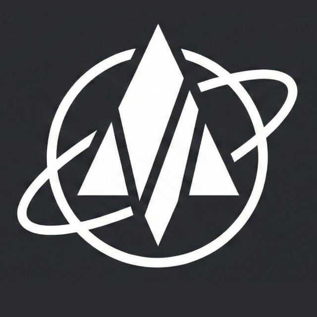

<div align="center">



<h3>Advanced Rocketry Kernel (ARK)</h3>

<p>
  
  
  
  
</p>

<p><em>A high-performance, crash-resilient, multi-rate RTOS kernel designed for competitive model rocketry and avionics.</em></p>

<p>
  <a href="#core-architecture">Architecture</a> •
  <a href="#fdir--shadow-state">FDIR & Shadow</a> •
  <a href="#hardware-support">Hardware</a> •
  <a href="#quick-start">Quick Start</a> •
  <a href="#contributing">Contributing</a>
</p>

<hr/>


<p><strong>Lead Architect: Kunsh Jain</strong><br/>
<em>Developed for Team Ignition, VIT Chennai</em></p>

</div>

---

## 🚀 Overview

**ARK (Advanced Rocketry Kernel)** is a professional-grade avionics firmware framework built to handle the extreme environments of high-power rocketry. Unlike standard sequential loops, ARK utilizes a **Superior Loop** scheduler to manage multiple sub-kernels at independent frequencies, ensuring deterministic flight control, real-time telemetry, and fail-safe recovery.

### Why ARK?
- **Fault Tolerance**: Integrated 8-bit FDIR engine for real-time anomaly detection.
- **Persistence**: Shadow State mirroring ensures flight data survives mid-air resets.
- **Portability**: Unified abstraction layer for both Raspberry Pi Pico and ESP32.
- **Deterministic**: Time-guarded execution prevents any single task from stalling the system.

---

## 🏗 Core Architecture

ARK is divided into three specialized micro-kernels managed by the **Superior Loop**:

<table>
<tr>
<td width="33%">
<h4>📡 Modules Kernel</h4>
<strong>Frequency: 200Hz</strong><br>
Handles hardware abstraction, sensor fusion (IMU, Baro, GPS), and low-level communication protocols (I2C/SPI).
</td>
<td width="33%">
<h4>🛡 System Kernel</h4>
<strong>Frequency: 200Hz</strong><br>
Manages the State Machine, FDIR Engine, and Health Monitoring. It is the "Brain" that ensures mission safety.
</td>
<td width="33%">
<h4>💻 User Kernel</h4>
<strong>Frequency: 100Hz</strong><br>
Dedicated space for mission-specific logic, PID control laws, and deployment triggers.
</td>
</tr>
</table>

---

## 🛡 FDIR & Shadow State

ARK is designed for **Zero-Loss Missions**. If the hardware fails or reboots, the system "Resurrects" using two core technologies:

### 1. 8-Bit FDIR Engine
The Fault Detection, Isolation, and Recovery engine monitors the system health bit-by-bit:
- `0x01`: I2C Bus Loss
- `0x02`: SPI Bus Loss
- `0x04`: Kernel Overrun (Guard Violation)
- `0x08`: Low Battery Voltage
- `... and 4 more mission-critical bits.`

### 2. Shadow State Mirroring
The **Shadow Registry** acts as a "Black Box" inside the internal Flash memory. It stores:
- **Last Flight State**: Prevents the rocket from thinking it's on the pad after a mid-air reset.
- **Last Known Altitude**: Provides continuity for deployment math.
- **Fault History**: Persists the reason for a crash across reboots.

---

## 🔧 Hardware Support

ARK features a **Hardware Abstraction Layer (HAL)** that allows the same flight code to run on different silicon:

- **Raspberry Pi Pico (RP2040)**: Optimized for dual-core ARM Cortex-M0+ using the Pico SDK.
- **ESP32**: Utilizes ESP-IDF with NVS (Non-Volatile Storage) for robust state persistence.
- **Communication Protocols**: Fully implemented drivers for **GPIO, I2C, SPI, and UART**.

---

## 🛠 Quick Start

### Prerequisites
- CMake (3.16+)
- ARM GCC Toolchain (for Pico)
- ESP-IDF (for ESP32)

### Build Instructions
```bash
# Clone the repository
git clone [https://github.com/teamignitionvitc/ARK-Advanced-Rocketry-Kernel.git](https://github.com/teamignitionvitc/ARK-Advanced-Rocketry-Kernel.git)
cd ARK-Advanced-Rocketry-Kernel

# Create build directory
mkdir build && cd build

# Compile for Pico
cmake -DARCH_TARGET=PICO ..
make

# Compile for ESP32
idf.py build

#🤝 Contributing
We are an elite team. To contribute to ARK:

Fork the repo.

Create a feature branch: git checkout -b feature/AmazingFeature.

Ensure your code complies with the Superior Loop Guard (no blocking delays!).

Open a Pull Request.

<div align="center">
<p>Distributed under the GNU General Public License v3.0.</p>
<p>Copyright © 2026 Team Ignition Software Department</p>
</div>